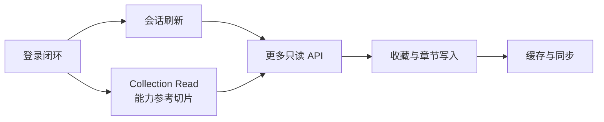

# Bangumi 模块设计索引

> 文档状态：Living Design  
> 当前阶段：浏览器登录闭环 + 公开条目搜索 + Collection Read 能力参考切片
> 前端架构：MVP（Model-View-Presenter）

本文件只负责导航、当前状态和跨专题约束。协议细节、接口字段和测试清单放在专题文档中，避免每次修改都加载一份不断膨胀的总设计。

## 专题文档

| 想了解或修改什么 | 阅读文档 | 内容边界 |
| --- | --- | --- |
| 登录、OAuth、回调、TokenStore、CLI | [login.md](login.md) | 从 App 配置到 `/v0/me` 验证的完整登录事务 |
| 功能声明、八项权限、动态指导、权限不足交互 | [capabilities.md](capabilities.md) | `BangumiCapability`、`BangumiModuleOptions` 与 remediation 契约 |
| 搜索条目 | [search.md](search.md) | 公开 POST 搜索、可选账号上下文、筛选、分页与 DTO |
| 获取用户收藏 | [collections.md](collections.md) | 官方端点、分页、DTO、解析、权限语义与首个接口 |
| 项目整体路线 | [../plan.md](../plan.md) | 播放器、数据层、同步和应用级规划 |

## 当前实现快照

- 浏览器 OAuth Authorization Code 流程、回环回调、随机 `state`、超时和 Token 交换。
- `/v0/me` 身份验证，登录成功后才提交 Token，并在首次交互输入时才保存 App ID/App Secret。
- 缺少 App 参数时展示个人应用创建链接、准确回调地址、最低权限与可选权限。
- 打开浏览器前远程预检授权页，可识别已观察到的 `app_nonexistence`；Token 交换阶段补充 App Secret/回调错误提示。
- 八项 Bangumi 权限使用位枚举表示；功能通过初始化 options 声明自己依赖的权限。
- 公开条目搜索支持完整筛选和分页；未登录时匿名请求，活动会话存在时使用可选 Token，不注册或检查 capability。
- `search` CLI 命令支持位置关键词、类型、排序、标签与分页；尽力复用已保存会话，恢复失败时继续匿名查询。
- `MemoryTokenStore`、`FileTokenStore` 和默认的 `SystemTokenStore`；系统后端覆盖 Linux Secret Service、Windows Credential Manager 与 macOS Keychain。
- 首个能力参考切片：读取当前登录用户的收藏，包含过滤、分页、DTO 映射和结构化权限修复信息。
- `collections` CLI 命令恢复会话、发起一页 GET 查询；Client 校验 DTO 后，CLI 输出服务端原始 JSON。

尚未完成：

- 真实 Bangumi 账号的端到端人工验收。
- Refresh Token 自动刷新。
- 收藏的 Qt 交互。
- 收藏写入、章节进度写入、缓存与同步。

## 跨专题约束

1. 严格采用 MVP。View 不直接调用 Auth、Client 或 TokenStore；业务入口通过 Presenter 和 `BangumiModule`。
2. Model 不读取 argv、不打印 stdout，也不把 OAuth JSON 暴露给上层。
3. Qt 对象留在创建线程；异步流程使用 Ilias Task 和 Qt Awaiter，不在事件循环中 `.wait()`。
4. Token 只进入 TokenStore，不进入普通设置或业务数据库；Client Secret 在设置文件中加密存储。
5. 错误文本和日志不得包含 token、code、client secret、完整回调 URL 或原始 Token 响应。
6. 功能声明只提供“需要什么权限”的用户指导；最终能否执行始终以 Bangumi API 的实际响应为准。
7. 新增外部协议事实时，应写入对应专题文档并附官方来源，不让高频知识只能靠反复翻阅远端文档。
8. 公开 API 不为统一形式强行注册 `requiredCapabilities=None` 的 feature；可以使用活动会话，但不得把登录变成前置条件。

## 运行日志

默认日志级别为 `info`，覆盖应用启动/退出、设置加载、凭据后端、登录状态迁移、OAuth 阶段、HTTP 请求结果和收藏操作结果。所有 CLI 命令可通过 `--log-level` 切换为 `trace`、`debug`、`info`、`warn`、`error` 或 `critical`；未启用 spdlog 时，消息仍使用 `std::format` 语法格式化，再交给 `qDebug`、`qInfo`、`qWarning` 或 `qCritical`。`main` 默认设置接近 spdlog 的“时间、级别、文件:行号、正文”Qt 消息模板，显式的 `QT_MESSAGE_PATTERN` 环境变量可覆盖它；`ANIME_LAND_LOG_LEVEL` 也可设置级别，命令行参数优先。

日志只使用固定路由模板和结构化元数据。禁止记录 token、授权码、client secret、OAuth state、完整回调 URL、原始 Token 响应和收藏响应正文；调试新增日志时也必须遵守这一边界。

## 渐进路线

原设计把收藏全部放在 Step 4。本次根据明确需求提前实现一个只读纵向切片，用于验证能力声明和权限交互 API；这不代表提前展开收藏写入、缓存或同步。

## 文件导航

| 文件 | 职责 |
| --- | --- |
| `src/bangumi/auth.*` | OAuth、预检、回调和 Token 交换 |
| `src/bangumi/capability.*` | 权限枚举元数据、功能声明、动态指导和修复错误 |
| `src/bangumi/search.*` | 公开条目搜索请求、响应 DTO、编码与校验 |
| `src/bangumi/collection.*` | 收藏查询值对象、DTO、URL 和 JSON 映射 |
| `src/bangumi/client.*` | `/v0/me`、公开搜索与收藏 HTTP 请求 |
| `src/bangumi/bangumi.hpp`, `module.cpp` | Model 门面、状态和事务编排 |
| `src/bangumi/config.*` | Token、错误模型和 TokenStore |
| `src/presentation/*` | Presenter 和 CLI View |

## 外部依据

- [Bangumi 开发者应用](https://bgm.tv/dev/app)
- [Bangumi API 文档](https://bangumi.github.io/api/)
- [Bangumi Server OpenAPI](https://github.com/bangumi/server/blob/master/openapi/v0.yaml)
- [Bangumi 用户授权机制](https://github.com/bangumi/api/blob/master/docs-raw/How-to-Auth.md)
- [Bangumi User-Agent 建议](https://github.com/bangumi/api/blob/master/docs-raw/user%20agent.md)

外部协议核对日期：2026-07-23。
