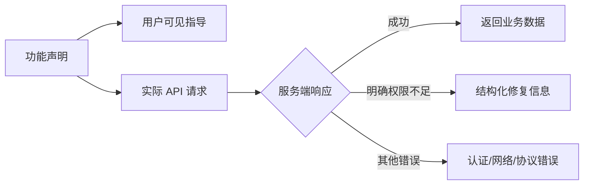

# Bangumi 功能与权限能力模型

> 范围：功能如何声明权限、登录指导如何动态生成，以及运行时权限不足如何向 UI 提供可操作信息。

## 为什么分开“功能”和“权限”

- 功能是 anime-land 提供给用户的行为，例如“获取用户收藏”。功能列表会持续增加。
- 权限是 Bangumi 开发者应用页面当前提供的固定八项复选能力，数量少且可组合。
- 功能声明负责描述“为了提供某功能，需要哪些权限”；它不是对实际 App 权限的真值判断。
- 实际可用性始终以 Bangumi API 响应为准。

这样 CLI、Qt UI 和未来设置页都不需要写死“收藏 READ 用于什么”。它们只渲染 Module 汇总后的指导。

## 八项能力位枚举

```cpp
enum class BangumiCapability : std::uint16_t {
    None            = 0,
    CollectionRead  = 1U << 0U,
    CollectionWrite = 1U << 1U,
    IndexRead       = 1U << 2U,
    IndexWrite      = 1U << 3U,
    TopicRead       = 1U << 4U,
    TopicWrite      = 1U << 5U,
    WikiRead        = 1U << 6U,
    WikiWrite       = 1U << 7U,
};
```

能力使用类型安全的 `operator|` 合并，以 `hasBangumiCapability()` 查询。位枚举适合当前固定八项权限；功能声明本身仍使用开放列表，不限制未来功能数量。

| 枚举 | 开发者页面 | 含义 |
| --- | --- | --- |
| `CollectionRead` | 收藏 READ | 获取用户收藏 |
| `CollectionWrite` | 收藏 WRITE | 修改用户收藏 |
| `IndexRead` | 目录 READ | 读取目录 |
| `IndexWrite` | 目录 WRITE | 修改目录 |
| `TopicRead` | 帖子 READ | 读取帖子 |
| `TopicWrite` | 帖子 WRITE | 发帖/回帖 |
| `WikiRead` | 维基 READ | 获取维基数据 |
| `WikiWrite` | 维基 WRITE | 进行维基编辑 |

“跨域请求”不是 API 数据能力，不进入枚举。当前桌面程序直接通过本机网络请求 API，`requiresCrossOrigin=false`。

## 功能声明与初始化 options

```cpp
struct BangumiFeatureDeclaration {
    std::string id;
    QString name;
    QString description;
    BangumiCapability requiredCapabilities = BangumiCapability::None;
};

struct BangumiModuleOptions {
    std::vector<BangumiFeatureDeclaration> features;
};
```

首个声明：

```cpp
BangumiFeatureDeclaration{
    .id = "user_collections.read",
    .name = u"获取用户收藏",
    .description = u"读取当前账号的收藏、评分与观看进度",
    .requiredCapabilities = BangumiCapability::CollectionRead,
};
```

`BangumiModule` 构造时接收 `BangumiModuleOptions`。收藏实现自己提供 `bangumiUserCollectionsFeature()`；composition root 初始化时把它追加到 options。以后每个独立功能模块用相同方式提交自己的 declaration，能力层不需要知道所有功能。功能实现也不需要引用 CLI 或 Qt 控件。

规则：

1. `id` 是稳定的机器标识，用于错误处理、埋点和 UI 路由。
2. `name` 与 `description` 面向用户，可本地化。
3. 一个功能可组合多个能力，例如 `CollectionRead | CollectionWrite`。
4. options 中未注册的功能不应通过 Module 门面执行；当前收藏 API 会返回 `InvalidState`。

## 动态创建指导

`buildBangumiOAuthApplicationGuide(settings, options)` 遍历八个单项位：

- 被至少一个启用功能需要的能力进入 `requiredCapabilities`，并附所有依赖它的功能。
- 没有启用功能需要的能力进入 `optionalCapabilities`。
- 开发者页面 URL 和回调地址来自 settings。
- 是否需要跨域是单独字段。

View 接收到的核心结构：

```cpp
struct BangumiOAuthApplicationGuide {
    QUrl applicationPageUrl;
    QString redirectUri;
    std::vector<BangumiCapabilityRequirement> requiredCapabilities;
    std::vector<BangumiCapabilityInfo> optionalCapabilities;
    bool requiresCrossOrigin;
};
```

因此当前 CLI 显示“收藏 READ —— 用于获取用户收藏”；以后加入目录功能后，指导会自动变化，而无需修改 CLI 文案。

## 权限不是本地真值

能力列表只用于指导，不能因为 `BangumiModuleOptions` 声明了某项能力就假定用户的 App 已经勾选。



当前不把 Token 响应的 `scope` 字符串当作唯一依据：服务端行为和开发者页面才是最终边界，而且外部 scope 表示需要在真实响应基础上验证后再形成稳定映射。

## 结构化权限错误

`BangumiErrorCode::MissingCapability` 搭配：

```cpp
struct BangumiCapabilityRemediation {
    BangumiCapability capability;
    std::string featureId;
    QString featureName;
    QString permissionName;
    QUrl applicationSettingsUrl;
};
```

当 API 明确返回权限不足时，Client 返回的错误应表达：

- 哪个功能被阻止；
- 需要打开哪个权限；
- 去哪个开发者页面修改；
- 修改后需要重新登录，让新 Token 反映新的应用权限。

未来 Presenter/View 可以据此实现：

1. 显示“获取用户收藏需要收藏 READ”。
2. 提供“打开应用设置”按钮。
3. 用户修改后触发重新登录。
4. 不把权限不足误报为一般网络失败。

## 无法可靠检测的情况

某些 Bangumi GET 接口允许匿名或低权限访问。服务端可能返回 HTTP 200，但省略私有或敏感数据。在没有服务端显式错误、响应 scope 声明或可验证哨兵字段时，客户端不能可靠区分“完整空结果”和“权限不足后的降级结果”。

处理原则：

- 401/403 或错误体明确出现 permission/scope/权限时，返回 `MissingCapability`。
- 401 且没有权限信号时，优先视为 Token 失效。
- 200 时按成功数据处理，不凭数据量猜测权限。
- 把这种限制写进具体功能文档；收藏的特殊情况见 [collections.md](collections.md)。

## 扩展示例

未来目录编辑功能可以提交：

```cpp
BangumiFeatureDeclaration{
    .id = "indices.edit",
    .name = u"编辑目录",
    .description = u"读取并修改用户目录",
    .requiredCapabilities =
        BangumiCapability::IndexRead | BangumiCapability::IndexWrite,
};
```

需要新增新的 Bangumi 权限时，修改范围应收束在：

1. 位枚举增加一个单项位；
2. `allBangumiCapabilities()` 加入它；
3. `bangumiCapabilityInfo()` 提供页面标签与说明；
4. 对应功能声明引用它；
5. 增加汇总与 remediation 测试。

## 测试要点

- 位组合和 `hasBangumiCapability()`。
- 一个能力被多个功能复用时只显示一次，并列出所有功能。
- 未使用能力进入可选列表。
- settings 中的开发者 URL 与回调地址原样进入指导。
- 明确权限错误包含 capability、feature ID/name 和修复 URL。
- 未注册功能不能静默执行。
