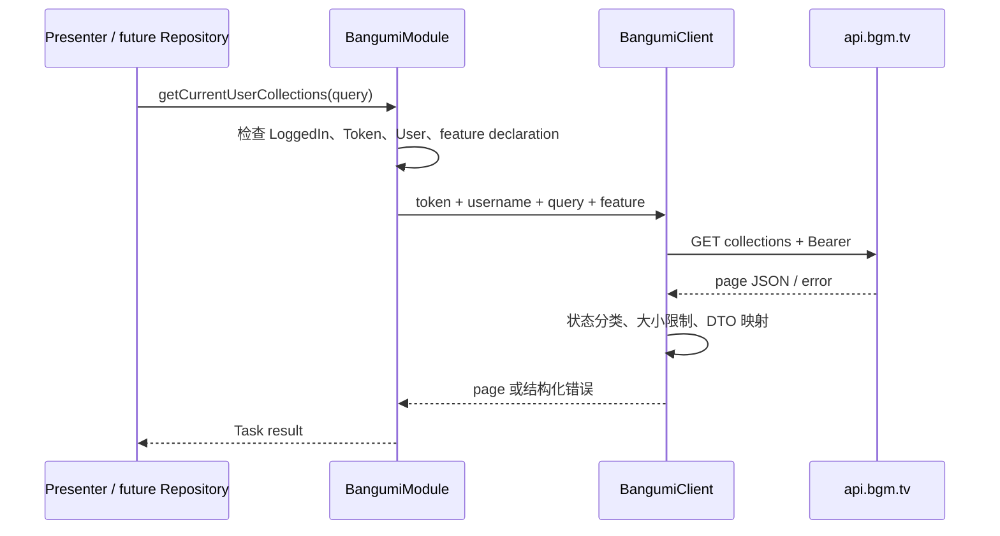

# 获取用户收藏

> 范围：`CollectionRead` 的首个真实功能路径。  
> 官方协议核对日期：2026-07-22。

## 本次边界

已实现：

- 读取当前已登录用户的一页收藏。
- 按条目类型和收藏状态过滤。
- `limit` / `offset` 分页。
- 官方响应字段到拥有型 DTO 的严格映射。
- 明确权限不足时返回 `CollectionRead` remediation。

未实现：

- 自动翻完所有页。
- Qt 收藏列表界面。
- 收藏写入和章节状态写入。
- 缓存、增量同步、冲突处理和重试策略。

它是能力声明 API 的参考纵向切片，不代表原 Step 4 的全部用户数据功能已经开始实现。

## 官方端点

```text
GET /v0/users/{username}/collections
Authorization: Bearer <access-token>
Accept: application/json
User-Agent: <configured-user-agent>
```

官方 OpenAPI 说明：该接口可以不认证访问公开收藏；查看私有收藏需要 Access Token。anime-land 的 `getCurrentUserCollections()` 总是使用当前登录用户名和 Bearer Token，目标是取得当前账号可见的完整结果。

来源：

- [Bangumi API 文档](https://bangumi.github.io/api/)
- [官方 OpenAPI 端点定义](https://github.com/bangumi/server/blob/master/openapi/v0.yaml)
- [UserSubjectCollection schema](https://github.com/bangumi/server/blob/master/openapi/components/user_subject_collection.yaml)

## 查询参数

```cpp
struct BangumiCollectionQuery {
    std::optional<BangumiSubjectType> subjectType;
    std::optional<BangumiCollectionType> collectionType;
    int limit = 30;
    int offset = 0;
};
```

| 参数 | 约束 | 说明 |
| --- | --- | --- |
| `subject_type` | 可选 | 条目类型 |
| `type` | 可选 | 收藏状态 |
| `limit` | 1..50，默认 30 | 官方默认 30、最大 50 |
| `offset` | >= 0，默认 0 | 偏移分页 |

条目类型：

| 值 | 枚举 | 含义 |
| --- | --- | --- |
| 1 | `Book` | 书籍 |
| 2 | `Anime` | 动画 |
| 3 | `Music` | 音乐 |
| 4 | `Game` | 游戏 |
| 6 | `Real` | 三次元 |

没有条目类型 5。

收藏状态：

| 值 | 枚举 | 含义 |
| --- | --- | --- |
| 1 | `Wish` | 想看 |
| 2 | `Done` | 看过 |
| 3 | `Doing` | 在看 |
| 4 | `OnHold` | 搁置 |
| 5 | `Dropped` | 抛弃 |

URL Builder 会在网络请求前拒绝非法枚举、空用户名、`limit > 50` 和负 offset，并对用户名 path segment 做 percent encoding。

## 分页响应

```cpp
struct BangumiUserCollectionPage {
    int total;
    int limit;
    int offset;
    std::vector<BangumiUserCollection> data;
};
```

当前只返回一页，不隐式递归请求。调用方可以使用 `offset + data.size() < total` 判断是否需要下一页。显式分页能让 UI 决定加载时机，也避免一次调用在大收藏账号上产生不可见的长请求序列。

## CLI 参考入口

官方请求是 GET，没有 request body；筛选值编码在 query string。CLI 把参数映射为 `BangumiCollectionQuery`：

```text
anime-land collections \
  --config ./settings.toml \
  --subject-type anime \
  --collection-type doing \
  --limit 30 \
  --offset 0
```

`--subject-type`：`all|book|anime|music|game|real`。  
`--collection-type`：`all|wish|done|doing|on-hold|dropped`。

命令先从所选 TokenStore 恢复并用 `/v0/me` 验证会话，再获取收藏。`collections` 与其他命令一样默认使用 system store，因此通常无需传 `--token-store`；只有显式选择 file store 时才传 `--token-file`。

服务端响应的 Content-Type 是 `application/json`。Client 先解析并验证为 DTO；解析成功后同时返回 `BangumiJsonResponse<T>` 中的强类型 `value` 和未经重写的 `rawJson`。CLI 直接输出 `rawJson`，所以服务端以后新增字段或区分 `null`/缺省时，调试输出不会悄悄丢失它们。

```cpp
template <typename T> struct BangumiJsonResponse {
    T value;             // 已按当前官方 schema 校验的结构
    QByteArray rawJson;  // 服务端返回的原始 JSON 字节
};
```

接口不是一个允许任意 method/body 的“万能请求器”。收藏查询遵循官方 GET 契约，筛选只放在 query string；未来真正需要 JSON request body 的 POST/PATCH API，应在各自的请求 DTO 中声明并由 Client 序列化。

## 收藏 DTO

官方 `UserSubjectCollection` 必需字段：

```cpp
struct BangumiUserCollection {
    std::int64_t subjectId;
    BangumiSubjectType subjectType;
    int rate;
    BangumiCollectionType collectionType;
    QString comment;                 // 官方可省略
    std::vector<QString> tags;
    int episodeStatus;
    int volumeStatus;
    QString updatedAt;
    bool isPrivate;
    std::optional<BangumiCollectionSubject> subject;
};
```

响应解析采用严格策略：必需字段缺失、类型错误、非法枚举、负进度、评分超出 0..10 或无效分页都会返回 `InvalidResponse`，不把破损数据静默转成默认值。

`subject` 在官方 schema 中不是必需字段，因此使用 `optional`。出现时必须满足官方 `SlimSubject` 的字段约束，包括名称、摘要、图片、册数/话数、收藏人数、评分、排名和标签。

### `updated_at` 的重要限制

官方 schema 明确说明：该时间不代表收藏时间；修改评分、评价或章节观看状态时没有更新它是已知问题。anime-land 只把它作为服务端原始元数据保存，不能用它可靠判断增量同步或冲突先后。

未来同步设计必须使用其他游标、完整比较或明确的本地同步记录，不能依赖 `updated_at`。

## 调用路径

```cpp
auto BangumiModule::getCurrentUserCollections(BangumiCollectionQuery query)
    -> ilias::Task<BangumiResult<BangumiUserCollectionsResponse>>;
```



前置条件：

- Module 必须处于 `LoggedIn` 且持有 Token 与已验证用户。
- `BangumiModuleOptions` 必须注册稳定 ID `user_collections.read`。
- 该 feature 声明 `CollectionRead`。

未登录返回 `NotLoggedIn`；功能未注册返回 `InvalidState`。

## 权限与失败语义

如果服务端明确返回 HTTP 403，或 401 错误体明确包含 permission/scope/权限信息，Client 返回：

```text
BangumiErrorCode::MissingCapability
required capability: CollectionRead
feature: user_collections.read / 获取用户收藏
action: https://bgm.tv/dev/app
```

UI 可以提示用户打开开发者应用设置、勾选“收藏 READ”，保存后重新登录。

如果是普通 401，则更可能是 Token 失效，返回 `Unauthorized`。网络失败、非权限 HTTP 错误和 JSON 错误分别保持自己的错误类别。

### 200 降级结果无法可靠识别

由于官方端点允许匿名读取公开收藏，权限不足时服务端可能不报错，而是返回用户公开可见的数据。若用户没有私有收藏，客户端无法从结果反推权限是否完整。因此：

- 不根据 `data.size()` 或 `private` 字段猜测权限；
- 只在服务端明确拒绝时生成 remediation；
- 登录创建指导提前要求 `CollectionRead`，降低运行时静默降级概率；
- 若官方以后提供可靠 scope introspection，再在能力层增加主动检查。

## 响应与安全上限

- 单页请求最多 50 条。
- 收藏响应体最大接受 4 MiB。
- Token 仅放在 Authorization Header，不进入 URL。
- 错误信息不包含 Token 或原始响应体。
- API Base 必须是有效 HTTPS URL。
- 活动请求可通过 `BangumiClient::cancel()` 取消。

## 测试覆盖

- 带条目类型、收藏状态、limit、offset 的 URL。
- 非法分页在请求前失败。
- 官方分页和 `UserSubjectCollection` 字段映射。
- 嵌入 `SlimSubject`、图片和标签映射。
- 枚举、字段类型和必需字段错误。
- 能力声明将 `CollectionRead` 列为最低权限。

后续应增加本地假 HTTP 服务组件测试，覆盖 200、401、403、404、超大响应、慢响应和取消。
