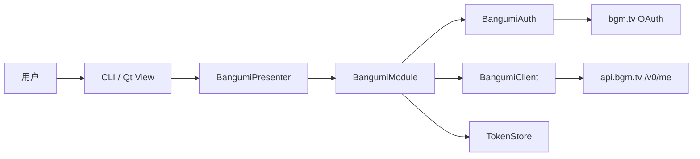
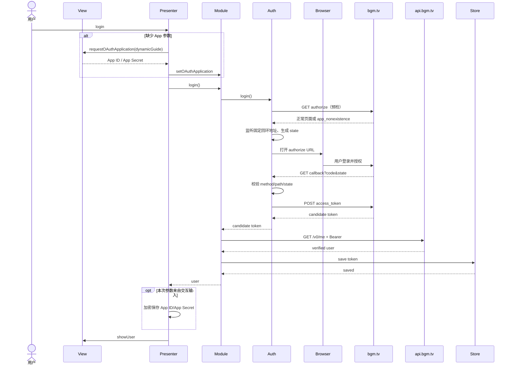
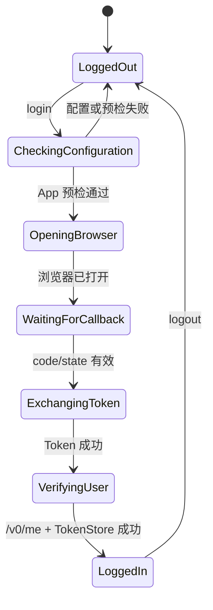

# Bangumi 浏览器登录

> 范围：OAuth 应用配置、浏览器登录、回环回调、Token 交换、`/v0/me`、凭据保存和 CLI 适配。  
> 权限指导见 [capabilities.md](capabilities.md)，收藏接口见 [collections.md](collections.md)。

## 目标与非目标

登录事务必须做到：

1. 用户主动触发后才打开系统浏览器。
2. 在打开浏览器前检查本地配置并预检 App ID。
3. 只在登录期间监听配置指定的 HTTP 回环地址。
4. 验证随机 `state` 后才交换授权码。
5. Token 交换成功后继续调用 `/v0/me` 验证身份。
6. TokenStore 保存成功后才进入 `LoggedIn`。
7. 首次交互输入的 App ID/App Secret 只有在完整登录验证成功后才写入配置。

本专题不展开 Refresh Token 自动刷新、多账号、内嵌 WebView 和业务数据同步。

## 模块边界



- View 只展示动态指导、进度、用户和错误。
- Presenter 负责请求 App 参数、调用 Model、映射退出码；不解析 OAuth 数据。
- Auth 不保存 Token，也不决定登录状态。
- Client 不打开浏览器。
- Module 是 Presenter 可见的 Model 门面，负责编排候选 Token 的提交或丢弃。

## OAuth 应用创建

当 `client_id` 或 `client_secret` 缺失时，View 从 `BangumiModule::oauthApplicationGuide()` 获取动态指导：

1. 使用自己的 Bangumi 账号登录并打开 <https://bgm.tv/dev/app>。
2. 创建“应用”。应用名、主页和简介由用户按实际情况填写。
3. 回调地址必须完整填写为当前配置值；默认是 `http://127.0.0.1:38457/callback`。
4. 按当前启用功能勾选最低权限。权限不是固定文本，而是由功能声明汇总；详见 [capabilities.md](capabilities.md)。
5. 桌面客户端不通过网页脚本跨域调用 API，所以默认不勾选“跨域请求”。
6. 创建后从页面顶部复制 `App ID` 和 `App Secret`。App ID 不是用户名，App Secret 不是账户密码。

默认配置：

```cpp
struct BangumiSettings {
    QString client_id;
    std::string client_secret;
    QUrl redirect_uri = QUrl("http://127.0.0.1:38457/callback");
    QUrl oauth_base = QUrl("https://bgm.tv");
    QUrl oauth_application_page = QUrl("https://bgm.tv/dev/app");
    QUrl bangumi_api = QUrl("https://api.bgm.tv");
    QString user_agent = QStringLiteral("Btk-Project/anime-land/...");
};
```

`oauth_base`、开发者页面和 API Base 分开配置，方便测试环境替换，也避免 View 写死链接。
Qt 字符串和 URL 通过 NekoProtoTools 的 `CustomParser<T>` 扩展序列化；
`client_secret` 保持字节串，以维持加密与内存擦除路径。

## 配置检查层次

配置无法在本地完全证明有效，因此分层检查：

| 阶段 | 能发现什么 | 不能发现什么 |
| --- | --- | --- |
| 本地语法检查 | 空值、空白/控制字符、异常长度、非法 HTTPS Base、非回环回调 | App 是否真实存在 |
| 授权页预检 | 当前已观察到的 `app_nonexistence`，以及基础网络/HTTP 失败 | App Secret；需要登录态才显示的服务端差异 |
| Token 交换 | 错误的 App Secret、授权码、回调不一致等服务端拒绝 | 尚未调用的业务 API 权限 |
| `/v0/me` | Access Token、API Base、User-Agent 和账号身份 | 后续每一项业务权限 |

预检使用与即将打开的授权 URL 相同的参数，但不发送 App Secret。检测到用户提供的失败页标记 `app_nonexistence` 时，返回 `InvalidConfiguration`，并附开发者页面、App 存在性、凭据和回调地址检查建议。

不要根据 App ID 当前外观做不可演进的强格式校验。当前实现只拒绝明显无效字符和长度，真实存在性由服务端预检判断。

## 登录时序



首次输入参数不再“输入即保存”。如果预检、授权、Token 交换或 `/v0/me` 失败，输入的 App 参数不会写入配置，避免把已知无效配置固化下来。

## 状态机

```cpp
enum class BangumiLoginState {
    LoggedOut,
    RestoringSession,
    CheckingConfiguration,
    OpeningBrowser,
    WaitingForCallback,
    ExchangingToken,
    VerifyingUser,
    LoggedIn,
};
```



同一时刻只允许一个登录事务。`logout()` 会取消 Auth 和 Client 的活动请求、关闭监听器、清空内存状态并清除所选 TokenStore。

## 回环回调安全约束

- 只接受 `http` 的 loopback host、固定端口和非空路径。
- 默认使用 `127.0.0.1`，避免 `localhost` 的 IPv4/IPv6 解析差异。
- 请求头最大 8 KiB，等待完整 `\r\n\r\n` 后再解析。
- 只接受 GET 和精确 callback path。
- `state` 使用系统随机源，每次登录重新生成，并以常量时间比较。
- 首个有效回调后关闭监听；总等待时间 120 秒。
- 浏览器完成页不包含 code、state、token 或用户信息。

## Token 交换与 `/v0/me`

Token 请求：

```text
POST https://bgm.tv/oauth/access_token
Content-Type: application/x-www-form-urlencoded
```

字段：`grant_type`、`client_id`、`client_secret`、`code`、`redirect_uri`、`state`。响应体可能包含凭据，任何错误路径都不得输出原文。

身份验证：

```text
GET https://api.bgm.tv/v0/me
Authorization: Bearer <access-token>
Accept: application/json
User-Agent: <configured-user-agent>
```

只有 `/v0/me` 成功且 `token.user_id` 与响应用户一致时，Module 才保存候选 Token。

## TokenStore

| 策略 | 持久性 | 语义 |
| --- | --- | --- |
| `memory` | 进程内 | 显式临时模式；退出即销毁，不生成静态 Token 文件 |
| `file` | 跨进程 | `QSaveFile` 原子写入、owner-only 权限；内容不是加密存储 |
| `system` | 跨进程 | 默认；Linux Secret Service、Windows Credential Manager、macOS Keychain |

未提供 `--token-store` 时，所有命令都使用 `system`。Linux 后端按稳定属性查找条目，处理 collection/item 解锁和桌面系统提示；Windows 与 macOS 分别使用原生 Credential Manager 和 Keychain API。系统凭据服务不可访问、用户取消提示或平台不受支持时返回结构化错误，绝不降级到未加密文件。只有用户明确指定 `--token-store file` 时才允许使用 `--token-file`。

App Secret 属于应用设置，不属于 TokenStore。设置保存时使用 libsodium 加密，并把密钥文件限制为 owner-only；桌面应用内的 Secret 仍无法获得服务端级保密性。

## CLI

```text
anime-land login  [--config PATH] [--token-store memory|file|system] [--token-file PATH]
anime-land status [--token-store memory|file|system] [--token-file PATH]
anime-land logout [--token-store memory|file|system] [--token-file PATH]
```

以上命令的 `--token-store` 默认值均为 `system`。

CLI 是正式 View，不是绕过 Presenter 的测试入口。将来 Qt View 实现同一 `BangumiView`，消费相同动态指导和结构化错误。

收藏查询命令属于 [collections.md](collections.md)，不在登录专题展开。

## 验证清单

- 授权 URL、回调 method/path/state/error 解析。
- App 参数本地检查与 `app_nonexistence` 页面识别。
- Token JSON、`/v0/me` JSON、敏感响应过滤。
- Memory/File/System TokenStore 语义。
- ArgParser 的 login/status/logout 和非法组合。
- 真实账号下的正确应用、错误 App ID、错误 Secret、错误回调、拒绝授权和端口占用。

外部依据：

- [Bangumi 用户授权机制](https://github.com/bangumi/api/blob/master/docs-raw/How-to-Auth.md)
- [OAuth 2.0 Authorization Code Grant](https://www.rfc-editor.org/rfc/rfc6749#section-4.1)
