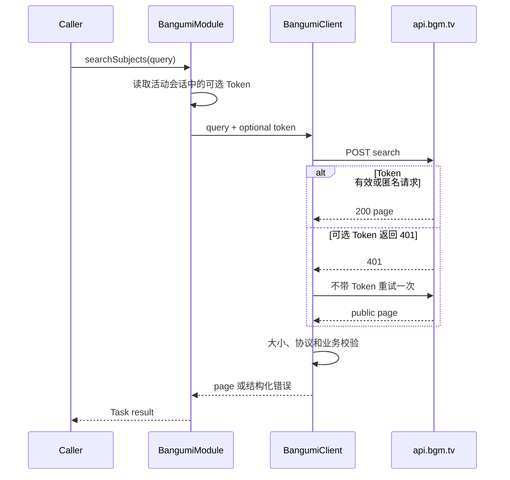

# Bangumi 条目搜索

> 范围：公开条目搜索、可选账号上下文、请求/响应 DTO 和失败语义。
> 官方协议核对日期：2026-07-23。

## 设计结论

条目搜索是公开目录能力：

```text
POST /v0/search/subjects
```

anime-land 的搜索 API：

- 未登录时直接匿名请求；
- 当前 `BangumiModule` 已有活动会话时附带现有 Bearer Token；
- `BangumiModule::searchSubjects()` 自身不触发登录、`restoreSession()` 或
  `/v0/me`；
- 不声明 `BangumiFeatureDeclaration`；
- 不检查任何 `BangumiCapability`；
- 可选 Token 被服务端以 401 拒绝时，自动退回匿名请求一次。

登录信息只是可选上下文，不是搜索的前置条件。

## 官方协议

官方端点：

```http
POST /v0/search/subjects?limit=20&offset=0
Accept: application/json
Content-Type: application/json
User-Agent: <configured-user-agent>
Authorization: Bearer <optional-access-token>

{
  "keyword": "葬送的芙莉莲",
  "sort": "match",
  "filter": {
    "type": [2],
    "tag": ["治愈"],
    "nsfw": false
  }
}
```

`limit` 和 `offset` 属于 query string，不进入 JSON body。

官方 OpenAPI 将此端点标为实验性 API，Schema 和实际行为可能变化，因此响应仍要执行
大小、类型、枚举和业务范围校验。

来源：

- [Bangumi API 文档](https://bangumi.github.io/api/)
- [Bangumi 官方 OpenAPI JSON](https://bangumi.github.io/api/dist.json)
- [Bangumi Server OpenAPI](https://github.com/bangumi/server/blob/master/openapi/v0.yaml)

## 请求类型

```cpp
enum class BangumiSubjectSearchSort {
    Match,
    Heat,
    Rank,
    Score,
};

struct BangumiSubjectSearchFilter {
    std::vector<BangumiSubjectType> types;
    std::vector<QString> metaTags;
    std::vector<QString> tags;
    std::vector<QString> airDates;
    std::vector<QString> ratings;
    std::vector<QString> ratingCounts;
    std::vector<QString> ranks;
    std::optional<bool> nsfw;
};

struct BangumiSubjectSearchQuery {
    QString keyword;
    BangumiSubjectSearchSort sort = BangumiSubjectSearchSort::Match;
    BangumiSubjectSearchFilter filter;
    int limit = 30;
    int offset = 0;
};
```

排序值：

| 枚举 | Wire value | 含义 |
| --- | --- | --- |
| `Match` | `match` | 匹配程度 |
| `Heat` | `heat` | 收藏人数 |
| `Rank` | `rank` | 排名 |
| `Score` | `score` | 评分 |

筛选字段：

| C++ 字段 | JSON 字段 | 语义 |
| --- | --- | --- |
| `types` | `type` | 条目类型；多值为“或” |
| `metaTags` | `meta_tags` | 公共标签；多值为“且” |
| `tags` | `tag` | 标签；多值为“且” |
| `airDates` | `air_date` | 日期范围表达式 |
| `ratings` | `rating` | 评分范围表达式 |
| `ratingCounts` | `rating_count` | 评分人数范围表达式 |
| `ranks` | `rank` | 排名范围表达式 |
| `nsfw` | `nsfw` | NSFW 过滤 |

不同筛选字段之间是“且”关系。空筛选字段不编码；整个筛选为空时省略 `filter`。

客户端约束：

- `limit` 为 1..50；
- `offset` 非负；
- 条目类型必须为 1、2、3、4 或 6；
- keyword 最长 512 个 UTF-16 code units；
- 每类筛选最多 32 项，每项非空且最长 128；
- JSON 请求体最大 64 KiB；
- API Base 必须是有效 HTTPS URL。

keyword 遵循官方 Schema，只要求字段存在，因此允许空字符串配合筛选使用。

## 响应类型

```cpp
struct BangumiSubjectSearchPage {
    int total;
    int limit;
    int offset;
    std::vector<BangumiSearchSubject> data;
};

using BangumiSubjectSearchResponse =
    BangumiResponse<BangumiSubjectSearchPage>;
```

`BangumiSearchSubject` 映射搜索页的标准 `Subject` 字段，包括：

```text
ID、类型、原名、中文名、简介、日期、平台
图片、册数、话数、总章节数
评分、排名、收藏统计
meta_tags、用户标签
NSFW、锁定与系列标记
```

v0.1 不暴露评分直方图 `rating.count` 和 `infobox`，协议读取器会验证 JSON 后忽略这两
类未消费字段。

响应验证包括：

- 分页值非负且 `limit <= 50`；
- 返回数据量不超过响应 `limit`；
- 条目 ID 为正且类型枚举合法；
- 计数非负；
- 评分有限且在 0..10；
- 日期为合法 `YYYY-MM-DD`；
- 标签名称非空；
- 响应体最大 8 MiB。

任一条目无效时整页返回 `InvalidResponse`，不提交部分结果。

## Module API

```cpp
auto BangumiModule::searchSubjects(BangumiSubjectSearchQuery query)
    -> ilias::Task<BangumiResult<BangumiSubjectSearchResponse>>;
```

调用路径：



Module 不检查：

```text
loginState == LoggedIn
currentUser 是否存在
BangumiModuleOptions.features
BangumiCapability
```

只有已经在当前 Module 会话中的 Token 才会被使用。搜索不会自行读取 TokenStore，
也不会为了取得 Token 发起 `/v0/me`。

## CLI

`main` 暴露公开搜索命令：

```bash
anime-land search "葬送的芙莉莲" \
  --subject-type anime \
  --sort match \
  --tag 治愈 \
  --limit 20 \
  --offset 0
```

参数：

- `<keyword>` 是必填位置参数；空字符串仍遵循官方 Schema，可配合标签筛选；
- `--subject-type all|book|anime|music|game|real`；
- `--sort match|heat|rank|score`；
- `--tag TAG` 与 `--meta-tag TAG` 可以重复；
- `--limit` 为 1..50，`--offset` 非负；
- 通用 `--config`、`--proxy`、`--log-level`、`--token-store` 和
  `--token-file` 仍然可用。

CLI 是一个新的短生命周期进程，因此会对所选 TokenStore 做一次尽力而为的会话恢复：

- 有有效已保存会话时，搜索可以带上该用户的可选 Token；
- 没有凭据、凭据过期、验证失败或凭据读取失败时，继续匿名搜索，不返回
  `NotLoggedIn`；
- 所选凭据后端连初始化都失败时，`main` 退回内存 TokenStore 并继续匿名搜索；
- 此行为只属于 CLI 编排，不改变 `BangumiModule::searchSubjects()` 本身“不自行恢复
  会话”的契约。

终端输出包含总数、分页位置，以及每个条目的 ID、类型、标题、日期、评分和排名。

## 错误语义

- 无效请求：`InvalidConfiguration`；
- 网络失败或非 2xx HTTP：`NetworkError`；
- 超大、非法或越界响应：`InvalidResponse`；
- 用户取消活动请求：`Cancelled`。

搜索不会返回 `MissingCapability` 或 `NotLoggedIn`。

若活动 Token 收到 401，Client 只对本次搜索退回匿名请求，不修改 Module 登录状态，
也不删除持久化凭据。账号状态修复由登录/会话流程负责。

## 安全和日志

- Token 只进入可选 Authorization Header；
- Token 不进入 URL、JSON body、日志或错误文本；
- 日志只记录请求路径、分页、耗时、状态码和是否使用可选身份；
- 不记录 keyword、标签和原始响应正文；
- Debug 构建可以在 `BangumiResponse::rawBody` 中保留已验证响应供现有调试路径使用。

## 测试覆盖

- 官方 POST URL、query string 和 JSON 字段映射；
- 匿名请求没有 Authorization Header；
- 活动 Token 能作为可选 Header 使用；
- 可选 Token 401 后匿名重试；
- 官方 `Paged_Subject` 响应解析；
- 标签、评分和收藏统计映射；
- 未登录且未注册 feature 时 Module 仍进入搜索参数校验；
- 非法分页在网络请求前失败。
